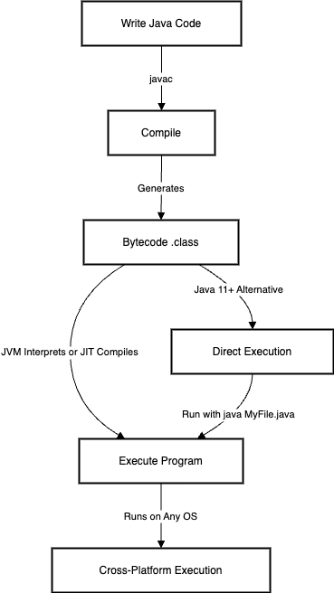

# Core Java Interview Questions & Answers

<!-- TOC_START -->
| No. | Questions |
| --- | --------- |
<!-- TOC_END -->

## Questions

<!-- QUESTIONS_START -->

Question & Answer: Java Application Execution Flow
Q1: What are the key steps involved in creating a Java application?
A: Creating a Java application involves three main steps:

Writing Java Code – Write source code in a .java file using a text editor or an IDE.
Compiling the Code – Use the Java compiler (javac) to convert the .java file into bytecode (.class file).
Executing the Code – Run the compiled bytecode using the Java Virtual Machine (JVM).
Q2: How do you write Java code?
A: Java code is written in a .java file using a text editor (like Notepad++) or an IDE (such as IntelliJ IDEA, Eclipse, VS Code). It follows OOP principles (Encapsulation, Inheritance, Polymorphism, and Abstraction) and must comply with Java syntax rules.

Q3: What happens during the compilation process?
A: The Java compiler (javac) translates the .java file into a .class file containing bytecode. The compiler also checks for syntax errors—if any exist, the compilation fails until they are fixed.

Q4: What is bytecode and why is it important?
A: Bytecode is an intermediate, platform-independent code that allows Java programs to run on any operating system with a JVM. Unlike native machine code, bytecode requires interpretation or Just-In-Time (JIT) compilation at runtime.

Q5: How does the JVM execute Java programs?
A: The JVM (Java Virtual Machine) loads and interprets bytecode or compiles it Just-In-Time (JIT) for better performance. This allows Java applications to run seamlessly across different platforms like Windows, macOS, and Linux.

Q6: What is Java SE 11’s direct execution feature?
A: Java SE 11 introduced the ability to run single-file programs without explicit compilation. You can execute a .java file directly using:


java MyFile.java
This method skips generating a .class file but is only applicable for single-file programs.
Q7: Can you summarize the Java execution flow?
A: Sure! The Java program execution follows this sequence:

[Write Java Code] → [Compile (javac)] → [Generate Bytecode (.class)] → [Execute on JVM]
For Java 11+, you can directly run a .java file:

[Write Java Code] → [Direct Execution (java MyFile.java)]
This structured process ensures platform independence, error checking, and efficient execution of Java applications.


## 1. What are the main features of Java?
### Answer:
Java is a high-level, object-oriented programming language with several key features:

- **Platform Independence:** Java follows the principle of "Write Once, Run Anywhere" (WORA) due to its JVM (Java Virtual Machine).
- **Object-Oriented:** Supports OOP concepts like encapsulation, inheritance, polymorphism, and abstraction.
- **Automatic Memory Management:** Java uses Garbage Collection (GC) to manage memory.
- **Multi-threading:** Java provides built-in support for concurrent programming.
- **Robust and Secure:** Java has strong type checking and security features such as bytecode verification and runtime security checks.
- **Rich API:** Java provides a vast standard library covering collections, networking, file handling, etc.
- **JIT Compiler:** Improves execution performance by converting bytecode to native machine code at runtime.

## 2. Explain the difference between JDK, JRE, and JVM.
### Answer:
- **JDK (Java Development Kit):** Includes JRE + development tools (compiler, debugger, etc.). Required for developing Java applications.
- **JRE (Java Runtime Environment):** Includes JVM + standard libraries. Needed to run Java applications but not to compile them.
- **JVM (Java Virtual Machine):** Converts bytecode into machine code for execution. It provides platform independence.

## 3. What are the principles of OOP in Java?
### Answer:
Java follows four key **Object-Oriented Programming (OOP)** principles:

1. **Encapsulation:** Data hiding using access modifiers (private, protected, etc.).
2. **Inheritance:** Allows a class to inherit properties from another class (extends keyword).
3. **Polymorphism:** Ability to perform different behaviors in different contexts (Method Overloading & Overriding).
4. **Abstraction:** Hiding implementation details and exposing only necessary functionalities (abstract classes & interfaces).

## 4. Explain the difference between `==` and `.equals()` in Java.
### Answer:
- `==` checks **reference equality** (whether two objects point to the same memory location).
- `.equals()` checks **content equality** (whether two objects contain the same data). 

Example:
```java
String s1 = new String("Hello");
String s2 = new String("Hello");
System.out.println(s1 == s2);       // false (Different memory locations)
System.out.println(s1.equals(s2));  // true (Same content)
```

## 5. What is the difference between `final`, `finally`, and `finalize()`?
### Answer:
- **`final`**: A keyword used to declare constants, prevent method overriding, or prevent class inheritance.
- **`finally`**: A block in exception handling that executes whether an exception is thrown or not.
- **`finalize()`**: A method called by the garbage collector before an object is removed from memory.

Example:
```java
final int MAX = 100; // Constant

try {
    int a = 5 / 0;
} catch (Exception e) {
    System.out.println("Exception caught");
} finally {
    System.out.println("Finally block executed");
}
```

## 6. What are Java access modifiers?
### Answer:
Java provides four access modifiers:

| Modifier  | Class | Package | Subclass | World |
|-----------|-------|---------|----------|--------|
| **public** | ✅ | ✅ | ✅ | ✅ |
| **protected** | ✅ | ✅ | ✅ | ❌ |
| **default (no modifier)** | ✅ | ✅ | ❌ | ❌ |
| **private** | ✅ | ❌ | ❌ | ❌ |

## 7. What are the different types of constructors in Java?
### Answer:
Java has three types of constructors:

1. **Default Constructor:** Provided by Java if no constructor is defined.
2. **Parameterized Constructor:** Accepts arguments to initialize an object.
3. **Copy Constructor:** Creates a copy of an existing object.

Example:
```java
class Car {
    String brand;
    
    // Default Constructor
    Car() {
        this.brand = "Toyota";
    }
    
    // Parameterized Constructor
    Car(String brand) {
        this.brand = brand;
    }
}
```

## 8. Explain the difference between `ArrayList` and `LinkedList`.
### Answer:
| Feature | ArrayList | LinkedList |
|---------|-----------|------------|
| Implementation | Uses a dynamic array | Uses a doubly linked list |
| Search Time | Fast (O(1) for index-based access) | Slow (O(n) for index-based access) |
| Insertion/Deletion | Slow (O(n) due to shifting) | Fast (O(1) if modifying head/tail) |
| Memory Overhead | Less | More (Extra memory for pointers) |

Use `ArrayList` when **searching is frequent**, and `LinkedList` when **frequent insertions/deletions occur**.

## 9. What is the Singleton Design Pattern?
### Answer:
Singleton ensures **only one instance** of a class exists.

### **Implementation in Java:**
```java
class Singleton {
    private static Singleton instance;
    
    private Singleton() {} // Private constructor
    
    public static Singleton getInstance() {
        if (instance == null) {
            instance = new Singleton();
        }
        return instance;
    }
}
```

## 10. What is the Factory Design Pattern?
### Answer:
Factory Pattern provides a way to instantiate objects without exposing logic.

### **Example:**
```java
interface Vehicle {
    void drive();
}
class Car implements Vehicle {
    public void drive() { System.out.println("Driving a Car"); }
}
class Bike implements Vehicle {
    public void drive() { System.out.println("Riding a Bike"); }
}
class VehicleFactory {
    public static Vehicle getVehicle(String type) {
        if (type.equals("Car")) return new Car();
        else if (type.equals("Bike")) return new Bike();
        return null;
    }
}
```
Usage:
```java
Vehicle vehicle = VehicleFactory.getVehicle("Car");
vehicle.drive();
```

<!-- QUESTIONS_END -->


